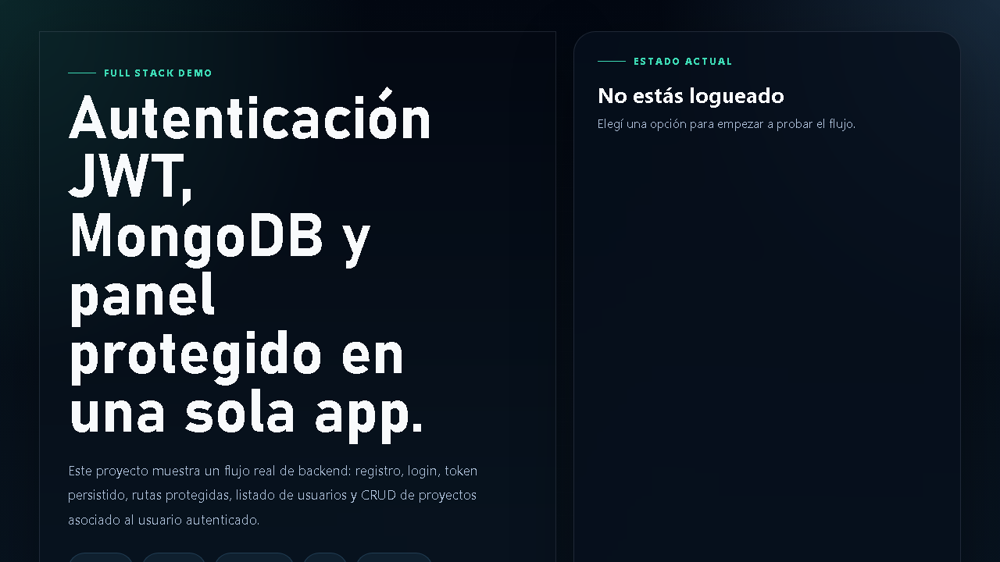
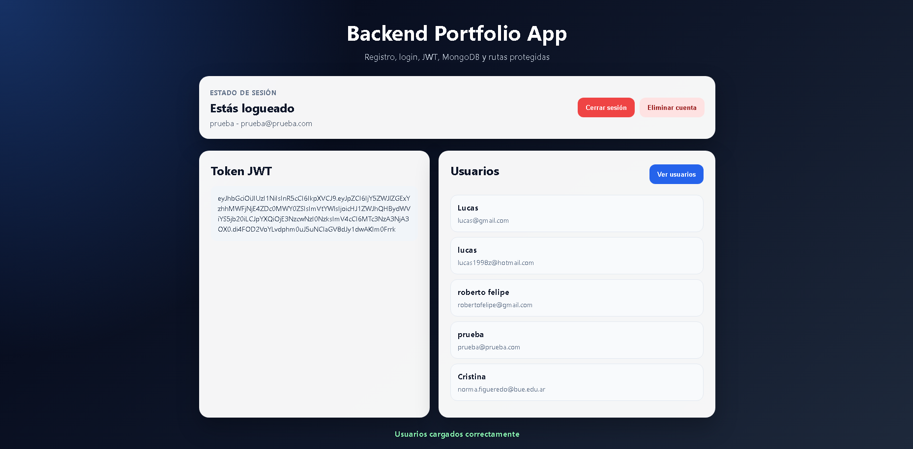

🚀 Backend Portfolio App

Aplicación fullstack desarrollada como proyecto de portfolio que incluye autenticación con JWT, base de datos en MongoDB y despliegue en la nube.

🌐 Demo en vivo

🔗 Frontend: https://backendloginregisteruser.netlify.app
🔗 Backend: https://backend-portafolio-r87v.onrender.com

##  Vista previa

🧠 Funcionalidades
Registro de usuarios
Login con autenticación JWT
Protección de rutas
Visualización de usuarios autenticados
Eliminación de cuenta
Manejo de sesión (login/logout)
Persistencia de datos en MongoDB

🛠️ Tecnologías utilizadas
Backend
Node.js
Express
MongoDB (Atlas)
JWT (jsonwebtoken)
bcrypt
dotenv
cors
Frontend
HTML
CSS
JavaScript (Vanilla)
Deploy
Render (Backend)
Netlify (Frontend)

🔐 Autenticación

Se implementa autenticación mediante JSON Web Tokens (JWT):

El usuario inicia sesión
El servidor genera un token
El frontend guarda el token en localStorage
Las rutas protegidas requieren ese token

